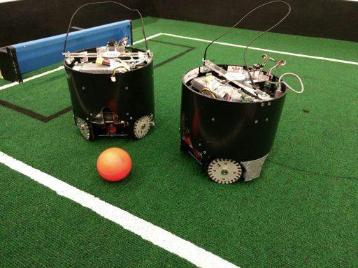

# CAZECAS - Robocup Soccer Open 2018
###### This is a collaboration with Mackenzie Presbyterian High School, which invited me to participate in the development of two junior soccer robots to participate in Robocup 2018 Montreal, Canada.

## Junior Soccer Preface

" In the RoboCupJunior soccer challenge, teams of young engineers design, build, and program two fully autonomous mobile robots to compete against another team in matches. The robots must detect a ball and score into a color-coded goal on a special field that resembles a human soccer field. 

To be successful, participants must demonstrate skills in programming, robotics, electronics and mechatronics. Teams are also expected to contribute to the advancement of the community as a whole by sharing their discoveries with other participants and by engaging in good sportsmanship, regardless of culture, age or result in the competition. All are expected to compete, learn, have fun, and grow. "

## Repository Contents

| Folder              | Content                                                      |
| ------------------- | ------------------------------------------------------------ |
| Alpha               | Software uploaded to the attacking robot (seeks the ball and attempts to score a goal or retreat) |
| Beta                | Software uploaded to the defending robot (aligns with the ball and strafes in front of goal) |
| CUP_x, sketch_may_x | Test modes for the various components of the robots          |
| Project_DOCUMENT    | Plan of objectives, costs and acknowledgement of the entire project, presented to Mackenzie High School (written in Brazilian Portuguese) |

to be written

## Hardware

Both the attacking and defender robots contain the same set of components, which are:

1. 1x Arduino DUE microcontroller ARM board
2. 4x Pololu 25D DC metal gearmotors
3. 4x Custom made omnidirectional roller wheels
4. 4x Pololu single-channel drivers 
5. 1x Secondary motor (dribbler control through a belt)
6. 1x Solenoid (act as kicker)
7. 1x Pixy CMUcam5 blob-identification camera sensor module
8. 4x Light reflectance sensors
9. 1x HC-SR04 ultrassonic rangefinder sensor
10. 1x Digital magnetometer sensor
11. 1x Battery level measuring/displaying circuit
12. 1x 12V LiPo battery (not seen in picture)

## Where to Find Me:

* [Telegram Contact 🔵](https://t.me/mekhyw)
* [YouTube Channel 🔴](https://www.youtube.com/channel/UC3__YPhMGjytXUqRUmriQ8A?view_as=subscriber)
* [Twitter Page 🐦](https://twitter.com/MekhyW)
* [Instagram Page 📸](https://www.instagram.com/mekhy_w/)

