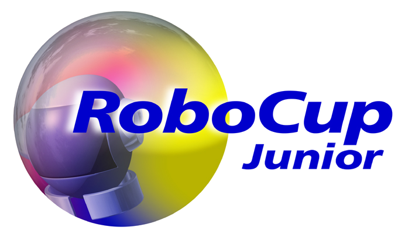

# CAZECAS - Robocup Soccer Open 2018
###### This is a collaboration with Mackenzie high school, which invited me to participate in the development of two junior soccer robots to participate in Robocup 2018 Montreal, Canada.

## Junior Soccer League

" In the RoboCupJunior soccer challenge, teams of young engineers design, build, and program two fully autonomous mobile robots to compete against another team in matches. The robots must detect a ball and score into a color-coded goal on a special field that resembles a human soccer field. 

To be successful, participants must demonstrate skills in programming, robotics, electronics and mechatronics. Teams are also expected to contribute to the advancement of the community as a whole by sharing their discoveries with other participants and by engaging in good sportsmanship, regardless of culture, age or result in the competition. All are expected to compete, learn, have fun, and grow. "

## Repository Contents

to be written

## Hardware

Both the attacking and defender robots contain the same set of components, which are:

1. 

## Where to Find Me:

* [Telegram Contact 🔵](https://t.me/mekhyw)
* [YouTube Channel 🔴](https://www.youtube.com/channel/UC3__YPhMGjytXUqRUmriQ8A?view_as=subscriber)
* [Twitter Page 🐦](https://twitter.com/MekhyW)
* [Instagram Page 📸](https://www.instagram.com/mekhy_w/)

